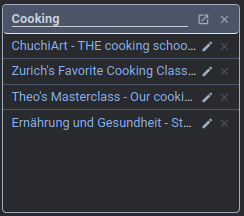

# Feature Overview

- [Feature Overview](#feature-overview)
  - [Keyboard Shortcuts](#keyboard-shortcuts)
  - [Manual Grouping](#manual-grouping)
    - [Current Tabs](#current-tabs)
    - [Curated Groups](#curated-groups)
      - [Focus Mode](#focus-mode)
  - [Sidebar](#sidebar)
  - [Suggestions](#suggestions)

To start using the manual and automated grouping features of the extension, please enter the activation key you have received upon conclusion of phase one.

You will be presented with an overview of your manually curated groups (empty), as well as some suggestions that have been computed from initial data collection. The remainder of this documentation goes into all of the features that are available to you during phase two.

## Keyboard Shortcuts

- `Ctrl+Shift+Q`: Open the extension sidebar on any page
- `Ctrl+Shift+S`: Open the extension overview in a new tab

You can customize these shortcuts in the Browser extension settings (Chrome: <chrome://extensions/shortcuts>, Firefox: <https://support.mozilla.org/en-US/kb/manage-extension-shortcuts-firefox>).

## Manual Grouping

### Current Tabs

The list of current tabs allows you to close any currently open tab (click on the `x`).

Additionally, tabs that have been open but unused for more than an hour will be marked as stale. You can close all of these tabs by clicking on the cleanup button in the top right.

You can drag and drop tabs to any other curated group that you might already have, as well as to the plus to create a new group.

### Curated Groups

You can open and close an entire group (i.e., all of its tabs) with the buttons in the top right. Grouped tabs that are currently open will be marked and can be closed by clicking on the respective `x`. Opening the context menu of a grouped tab (right-click on the tab) will further allow you to remove the tab from the group and to open it in a new tab.

The context menu of a group (right-click on the header) additionally allows you to delete the group, close all tabs **except** the ones in that group, as well as to open that group in a new window.

#### Focus Mode

We have also implemented a `Focus Mode` to improve your workflow if you regularly switch groups/tasks. Once focus mode is activated and you open a tab group (as described above), all other tab groups that are currently open will be closed. This allows you to switch tasks while cleaning up unneeded tabs simultaneously.

## Sidebar

In addition to the view you can open with the extension button in your browser bar, we also offer a sidebar view that you can open on any webpage you are on. To do so, click on the sidebar trigger button in the bottom left of your page. You can also use the keyboard shortcut `Ctrl+Shift+Q` (or `Cmd+Shift+Q` on MacOS) to directly open the sidebar.

The sidebar allows you all of the same interactions that you know from the other extension view, while bringing these interactions closer to where you are browsing.

## Suggestions

Once the grouping heuristics have collected enough data, you will be presented with suggestions for groups that you might want to add to your curated groups. Such a suggestion might look as follows:

When you want to persist that suggestion in your curated list, click the save button in the top right. If the suggestion is not helpful, you can discard it using the trash icon. You can also discard single tabs within that suggestion and, after doing so, persist only what remains. Additionally, you can freely drag and drop from suggested groups to your curated groups.

When a significant overlap is detected, the heuristics might also suggest additions to existing curated groups. These could look as pictures below:

You can accept these additions by dragging the additional tab into your curated group, or discard them by clicking the trash icon.
