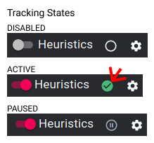

# Data Collection

Now that you have installed and enabled the heuristics engine, we will start tracking your browsing behavior in terms of interactions and aggregate statistics.

## Collected Data

We will not (cannot) track any interactions performed in incognito mode or in browsers other than this one.

We collect the following data while you are browsing with tracking enabled:

### Phase 1 & 2

- Aggregate Statistics (e.g., number of tab switches, number of open tabs, average age of tabs)
- Tab interactions (e.g., opening a new tab, closing a tab, updating the location of a tab, tab switches)
- Usage statistics (i.e., active minutes)
- Suggested tab groups (periodic snapshots of our algorithm output)

The collected data about tab interactions contains the URL and Title of the respective tabs but without the potentially sensitive URL parameters at the end of the URL.

### Phase 2

- Heuristics interactions (e.g., accepting a suggested tab group, discarding a suggested tab)

## Pause & Resume

You can pause and resume tracking of your behavior by clicking on the (pause/green) circle as shown below:

## Data Storage and Review

All data is stored in your user home directory (i.e., `/home/X/tabs` on Linux and `C:/Users/X/tabs` on Windows). You are free to have a look and censor the collected data at any time; however, we would advise you to focus on the final review after the conclusion of the second phase. This will save you time and allows you to work more efficiently using our review and cleanup tooling.
