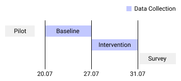

# Introduction

Welcome and thanks for your participation in to the user study on `Automated Tab Organization`.

You should have received and signed a consent form with the full study procedures; nevertheless, the following provides a short summary of the study procedures.

## Phases

### Baseline Phase (1 work week)

You setup a heuristics backend (next tutorial step) that will analyze your browsing behavior and collect aggregate statistics about tab interactions. The collected data will allow us to compare the effect of our grouping functionality with a baseline.

### Intervention Phase (1 work week)

You enter an activation key that enables manual and automated grouping features. You can use these features while going about your normal workweek. We will prompt you to interact with our suggestions at least once a day (e.g., discard a subjectively bad group).

## Study Conclusion

To conclude your participation in the study after the second phase, you will be asked to participate in an interview and fill out a survey about your participation. Additionally, you will be able to review the data that we have collected before you can send it to us.

### Interview (ca. 20 min)

We will use the interview to discuss the quality of our suggestions using some of your real examples. We will record the interview for the purposes of transcription if you explicitly agree on the consent form.

### Survey (ca. 10 min)

The survey will collect some demographic information as well as more standardized data and feedback about the study.

### Data Submission (ca. 5 - 30min)

You will be able to review and censor all of the data that we have collected and stored on your local machine.

We will provide you with a set of supporting scripts that should make this much easier.

## Heuristics Setup

The next step of the tutorial will take you through the necessary setup steps for the heuristics backend that will collect data and provide you with suggestions.
